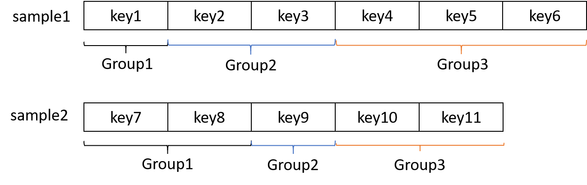
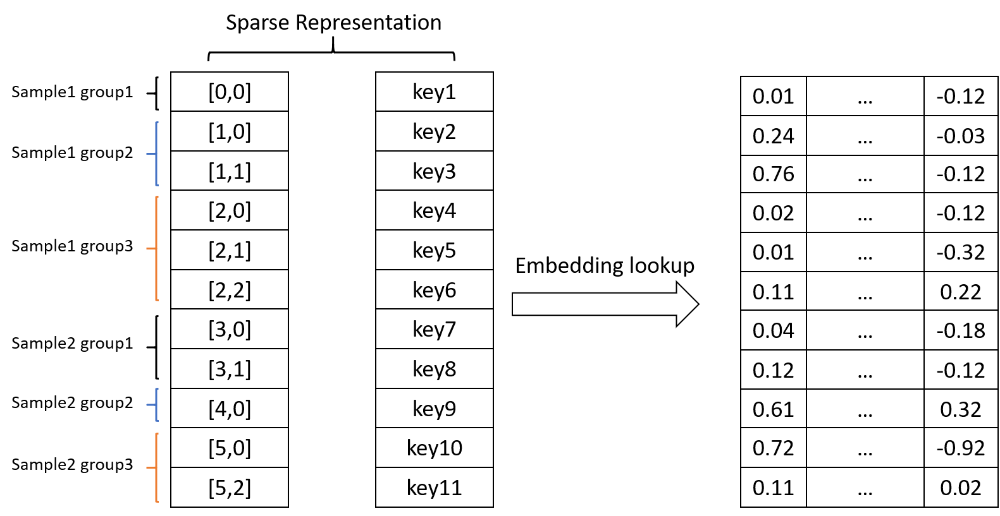
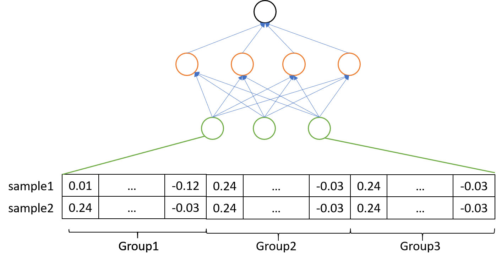
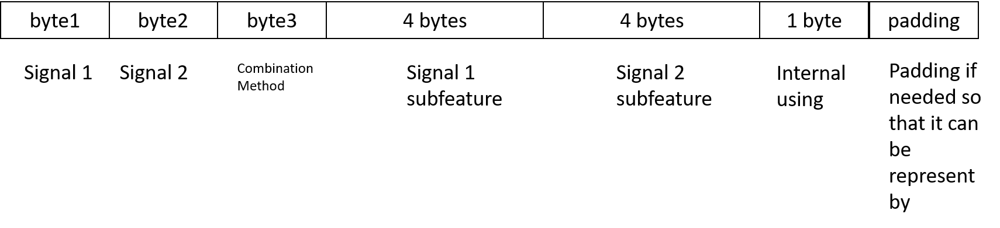

# Falcon
Falcon is an efficient implementation of large scale distributed DNN trainer for spase id features. For example, Deep & Wide models for advertisement or recommendation click through rate prediction is dominant in industry, computational advertisement will use billions of sparse id features to modeling user response, like user id, advertiser id, os versions and locations, etcs.

We will always mapping each feature into different ids, however, it's tedious and computation cost to assign a unique id for each feature, especially when the training data is huge which is common for CTR tasks. In this project, we implemented a custom operation to extend tensorflow so that it can auto hash a raw feature into a unique id when training on the fly, so we don't need to assign the ids before training.

## DNN with large scale sparse id features
Like Deep & Wide or DeepFM networks, sparse id features are always seperated into different groups, usually we have fixed number of feature groups, however, each feature group has dynamic features. In the following example, we have 2 samples, each sample will have 3 feature groups, and we can see for the same group, each sample will have different features. Take paid search advertisement for example, if one feature group is to find all common word tokens between users query and advertisers' keyword, so we will have different number of tokens between different query and keywords.



To improve the computation efficiency, we will organize all features in different group and samples into a sparse representation, we use a indices tensor to reprensent which group and inner index within the group, and we used a continuous tensor to concate all features together. To make it more clear, in the indices tensor, [5,2] means this feature is in the 5th group, which is actually 2nd feature in the group 3 in sample 2.


As we have the sparse value tensors, we will use the feature_hash_op implemented in this project to hash all raw keys into a unique id, and the same key will be assigned the same id. Then we will use the key id to lookup corresponding embeddings of this feature, we will cover this part later. After that, we will use sum pooling or mean pooling to group all embeddings together, if they belong to the same sample and same feature group. After that, each sample can be reprensented into a fixed size input embeddings, and a DNN network can be used for modeling.


## how to build this project for different enviroments

only tensorflow 1.x is supported, it will have problem with 2.x eager execution. We implemented custom op (a.k.a feature_hash_op) to extend tensorflow, the build pipeline is based on [tensorflow/custom-op](https://github.com/tensorflow/custom-op) project, see it for more details.

After build successfully, you can wrap the custom op .so file into a pip package so that you can distributed it, or you can just copy the .so file for using. However, the .so file must be compatible with the tensorflow version you choosed when building.

1. set up the docker for building enviroment

```
docker pull tensorflow/tensorflow:custom-op-ubuntu16
docker run -it tensorflow/tensorflow:custom-op-ubuntu16 /bin/bash
```

2. git clone this repo

```
git clone 
```

3. select target tensorflow version to build this project for it

As custom-op-ubuntu16 docker installed tensorflow 2.4, we need to uninstall it first after start the docker

```
sudo pip uninstall tensorflow-cpu
```

then we need to configure the target tensorflow for our custom op, let's take tensorflow 1.15 for example, run configure.sh and select according to the prompt

```
./configure.sh
```

4. build the custom op

C++ code for our custom op feature_hash_op is in feature_hash_op/cc/, and after build it, and python test file is in feature_hash_op/python/ a _feature_hash_ops.so file will be generated in feature_hash_op/python/ops/ directory. The build pipeline is in Makefile, Please use this command to build the feature_hash_op in the root directory of this git repo.

```
make feature_hash_op
```

In case you have problems in building, you can directly used the built feature_hash_op/python/ops/_feature_hash_ops.so.bak, please remember to remove the .bak extension.

5. (optional) build pip package and directly import is in python

see tensorflow/custom-op repo for how to build pip packages


### how to use the custom op to hash features into ids

you need to represent your raw features into byte based format, let's still take paid search advertisement for example, you may have different feature signals like users, query, keywords, locations, and you want all feature is combination of any two of them, and different combination method is also supported for the same two signals. So you can use 11 bytes to represent your raw features, for example one feature is to get all  token combination between query and keyword, first byte indicate this is query, second byte indicate this is keyword, third byte means that this feature is token combation between query and keyword, and then we use a int32(4 bytes) to represent the token in query, and another int32(4 bytes) to represent token in keyword.

So each raw feature is actually 11 bytes, and we can hash this 11 bytes into any unique id, however, feature_hash_op still need another 1 byte for internal using, so you need 12 bytes. And for simplicity to use tensorflow, so you need to represent your feature into 12 bytes, which is 3 int32. Let's say you have 10 featues, and your features should be be a [10, 3] int32 tensor. So keep in mind, size_per_key is the real bytes you used for raw feature, and size_per_bucket is the bytes you used in tensorflow for each feature, if you size_per_key is 11, then size_per_bucket is 12. If you size_per_key is 12, then size_per_bucket should be 16, because you need another 1 byte for feature_hashing_op, so you need 16 bytes (4 int32) to represent your feature in tensorflow.




For more details, please see a simple examle in example/ to know how to pass correct parameters ot feature_to_hash op.

### distributed training

Pleae see [horovod](https://github.com/horovod/horovod) for how to use it for distributed training, a better suggestion is to write a custom docker file to include the tensorflow/custom-op docker images as base image, and includes other layers in official hovorod images, then start distibuted training using different docker containers.